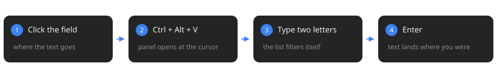
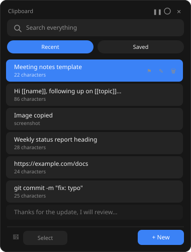

<p align="center">
  
</p>

<p align="center">
  
</p>

<p align="center">
  
  
  
</p>

Windows keeps 25 clipboard entries and drops them on restart. This keeps
80, plus anything you save into your own folders, which never expires.

<p align="center">
  
</p>

<table>
<tr>
<td width="56%" valign="top">

## What it does

### Automatic history

Everything you copy shows up in **Recent** — text and screenshots. Pin
the ones you use often and they stay at the top, safe from the cleanup
that trims the rest.

### Your own folders

**Saved** holds what you decide to keep. Pick a folder and a **Borrar
carpeta** button appears; it takes the folder and everything inside.
Right-click a chip to rename it instead. Nothing here expires.

### Search that ranks

Type across both tabs at once. Words come in any order — `inv rep`
finds `Monthly report — invoicing`. Accents are ignored, so
`informacion` matches `información`. Title matches rank above matches
buried in the body.

### Rich text

Pastes with font, size, bold and colour into Word and Outlook. Plain
text everywhere else. <kbd>Ctrl</kbd>+<kbd>Enter</kbd> forces plain.

### Fill-in templates

Write `[[anything]]` in a saved text and the app asks for it before
pasting:

```
Hi [[name]], following up on [[topic]] from [[date]].
```

Pick that entry, fill three fields, and the finished sentence goes
straight into your form.

### Bulk import

Paste a list of ten names and choose: one note per line, or all of it in
a single note. Numbering and bullets get stripped if you want.

### Four sizes

Mini, small, medium and large, from the appearance dialog. Mini drops to
single-line rows so it still shows a useful number of entries.

Free edge-dragging isn't offered on purpose — CustomTkinter doesn't
repaint reliably under continuous resizing, and the result was worse
than no resizing at all.

</td>
<td width="44%" valign="top">



</td>
</tr>
</table>

## Install

<details open>
<summary><b>Download the .exe</b></summary>

<br>

Grab `pastepad.exe` from
[Releases](https://github.com/Josemgu/pastepad/releases). No installer,
no Python needed. Put it wherever you want it to live and run it once
from there.

Every release is built on a clean GitHub Actions runner from the source
in this repo — the build log is public — and ships a SHA256 checksum:

```powershell
Get-FileHash pastepad.exe -Algorithm SHA256
```

Windows Defender will warn on first run. The binary isn't code-signed,
and PyInstaller output trips antivirus heuristics because it bundles and
self-extracts a Python runtime, which is also how a lot of malware is
packaged. Click *More info* → *Run anyway*, or build it yourself below.

</details>

<details>
<summary><b>Run from source</b></summary>

<br>

Python 3.10 or newer from
[python.org](https://www.python.org/downloads/). Check **Add python.exe
to PATH** on the first installer screen — nothing works without it.

```powershell
pip install -r requirements.txt
python pastepad.pyw
```

</details>

<details>
<summary><b>Build the .exe yourself</b></summary>

<br>

```powershell
pip install pyinstaller
pyinstaller --onefile --noconsole --name pastepad ^
  --icon docs\pastepad.ico ^
  --version-file version.txt ^
  --collect-all customtkinter ^
  pastepad.pyw
```

Or just double-click `build.bat`. The result lands in `dist\`.

Run it as administrator. Windows blocks global hotkeys from reaching a
normal process while an elevated window has focus, so without this the
shortcut fails in exactly the apps where you need it most.

</details>

<details>
<summary><b>Never installed Python before?</b></summary>

<br>

Full step-by-step walkthrough in Spanish:
[COMO-INSTALAR.txt](COMO-INSTALAR.txt)

</details>

## Usage

| Key | Action |
|---|---|
| <kbd>Ctrl</kbd> <kbd>Alt</kbd> <kbd>V</kbd> | Open the panel at the cursor |
| Type | Filter as you go |
| <kbd>↑</kbd> <kbd>↓</kbd> | Move through results |
| <kbd>Enter</kbd> | Paste |
| <kbd>Ctrl</kbd> <kbd>Enter</kbd> | Paste as plain text |
| <kbd>Esc</kbd> | Close |

A single click on a row pastes it. The three icons on the right — pin,
edit, delete — act on that row instead. **Seleccionar** turns on
multi-select: tick several rows, then **Borrar (n)** removes them
together.

Click into the field you want to fill **before** opening the panel. The
app records which window had focus and hands it back before sending the
paste.

## Where your data lives

Next to the executable, in plain files you can copy or back up:

```
snippets.json     saved texts and folders
historial.json    automatic history
config.json       accent colour and panel size
imagenes\         copied screenshots
```

Move that folder to another machine and everything comes with it.

## Notes

> [!WARNING]
> **The history is stored unencrypted** on your own disk. Password
> managers are handled (see below), but anything else sensitive you copy
> during the day does get written down. The broom button empties it, and
> the pause button stops capture entirely. Worth knowing before you
> install this on a shared machine.

> [!NOTE]
> **Respects password managers.** Windows defines
> [clipboard formats](https://learn.microsoft.com/en-us/windows/win32/dataxchg/clipboard-formats)
> that let an app say "do not record this" — KeePass, Bitwarden, Windows
> Credential Manager and Chrome's incognito mode all use them. pastepad
> honours all four and doesn't even open the clipboard when one is
> present.

> [!TIP]
> **Don't put the folder inside OneDrive.** Sync can lock the JSON files
> mid-write and you lose whatever you just saved.

## Why another one

[Ditto](https://github.com/sabrogden/Ditto) and
[CopyQ](https://github.com/hluk/CopyQ) are excellent and have years of
work behind them. I built this because my daily work needed two things
neither one does out of the box: fill-in templates for notes I retype
constantly, and rich-text paste that survives into Outlook.

## Built with

Python, [CustomTkinter](https://github.com/TomSchimansky/CustomTkinter),
pywin32 and keyboard.

The list is drawn on a canvas rather than built from widgets. Rendering
one widget per row meant rebuilding hundreds of them on every keystroke,
which made search unusable once the history filled up. Hovering a row
recolours two rows instead of repainting the canvas, and the clipboard
is only read when Windows' sequence number changes.

## Security

Details and recommendations in [SECURITY.md](SECURITY.md).

## License

[MIT](LICENSE)
