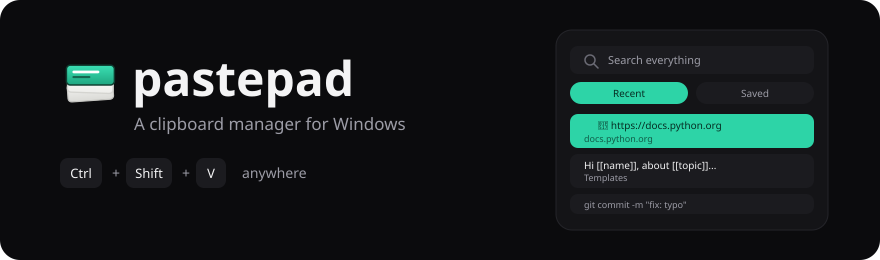
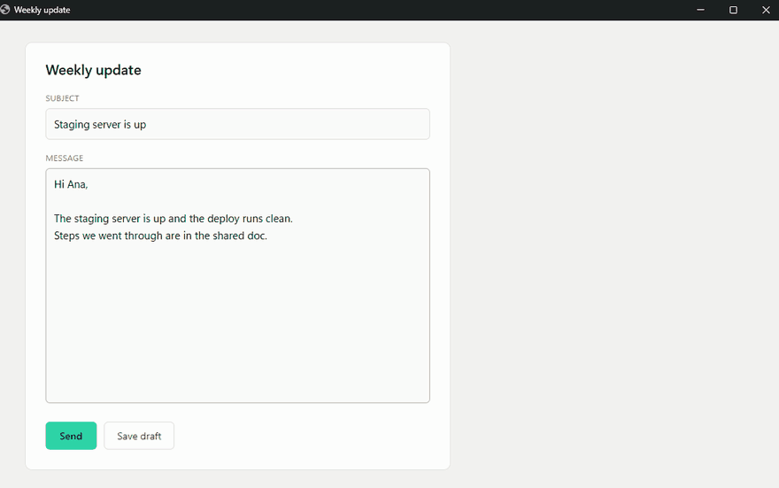
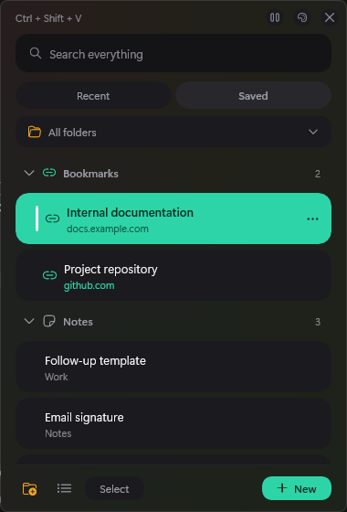
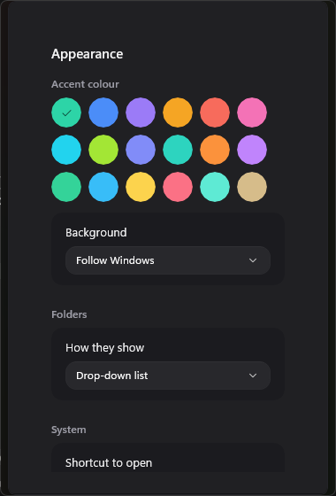

<div align="center">



<hr>

[](https://github.com/Josemgu/pastepad/releases/latest)
[](https://github.com/Josemgu/pastepad/actions/workflows/release.yml)

[](LICENSE)

[English](README.md) · [Español](docs/README.es.md)

**A clipboard manager for Windows.**

[](https://github.com/Josemgu/pastepad/releases/latest)

</div>

Windows keeps 25 clipboard entries and forgets them when you restart.
pastepad keeps 80, plus whatever you file into your own folders, which
never expire.

Press <kbd>Ctrl</kbd>+<kbd>Shift</kbd>+<kbd>V</kbd> anywhere. Type two
letters, hit <kbd>Enter</kbd>, and the text lands in the field you were
working in.

<div align="center">






</div>

## What it does

Everything you copy shows up under Recent, text and screenshots alike.
Pin what you use often and it stays on top.

Saved texts live in folders you name, and one with `[[fields]]` in it
becomes a template — pastepad asks for them before pasting.

Copy a web address on its own and pastepad treats it as a link: the row
shows the domain, and clicking opens the browser instead of pasting.
Bookmarks sit in their own group under Saved.

Search covers both tabs. Words can come in any order and accents are
ignored.

Password managers mark their content as private, and pastepad never
records it. KeePass, Bitwarden, Windows Credential Manager and Chrome's
incognito windows all do this.

## Templates

Anything you wrap in `[[double brackets]]` becomes a blank to fill in.
The row is marked `{}` so you can tell at a glance which ones will ask,
and templates sit in their own group under Saved.

**Making one**

1. Open the panel, go to **Saved**, press **New**.
2. Write the text, and put `[[brackets]]` around whatever changes each
   time.
3. Choose a folder under **Save into** and press **Add**.

**Using it**

Click into the field you want to fill, open the panel, and click the
template. **Fill in before pasting** appears with one box per blank.
Fill them and press **Paste**.

For details you retype constantly:

```
Name: [[name]]
Surname: [[surname]]
Date of birth: [[date of birth]]
```

For an email:

```
Hi [[name]], following up on [[topic]] from [[date]].
```

**Emails: one folder for subjects, one for bodies**

In Gmail and Outlook the subject and the body are two separate fields,
and pastepad pastes into one field at a time — the one your cursor was
in. Rather than fight that, give each one its own folder:

1. Make a folder called **Subjects** and another called **Bodies**.
2. Click the subject field, open the panel, pick from **Subjects**.
3. Click the body, open the panel again, pick from **Bodies**.

Two pastes, and you choose the body you want each time instead of being
tied to one. Folders show as chips along the top, so each list is one
click away.

## Using it

| Key | Action |
|:--|:--|
| <kbd>Ctrl</kbd> <kbd>Shift</kbd> <kbd>V</kbd> | Open the panel at the cursor |
| Type | Filter as you go |
| <kbd>↑</kbd> <kbd>↓</kbd> | Move through results |
| <kbd>Enter</kbd> | Paste |
| <kbd>Esc</kbd> | Close |

Click into the field you want to fill before opening the panel. pastepad
remembers which window had focus and gives it back before pasting.

The X only hides the panel. To close it for good, use Exit from the tray
icon.

## Installing

Download the installer from the
[latest release](https://github.com/Josemgu/pastepad/releases/latest)
and run it. It weighs 47 MB.

```
program   %LOCALAPPDATA%\Programs\pastepad
data      %LOCALAPPDATA%\pastepad
uninstall Settings → Apps → Installed apps
```

It installs for your user only, so there is no administrator prompt —
not when installing and not when updating. Uninstalling removes the
program and leaves your data alone, which is why the two are in separate
folders.

pastepad tells you when a new version is out and updates without losing
what you just copied.

## The Windows warning

The first run shows *"Windows protected your PC"*. Choose **More info**,
then **Run anyway**.

SmartScreen does not read the licence or the source. It looks for a
signature and for download history, and a new unsigned program has
neither. A free certificate from [SignPath](https://signpath.org/) is
being requested, which is what makes the warning go away for good.

Every release ships a `SHA256.txt` so you can check your download
matches the build.

## How it's built

C# on .NET 10 with WinUI 3. The clipboard, the global shortcut, the tray
icon and the focus handoff are Win32 calls; the rest is XAML. The data
layer has 78 tests that run without opening a window.

Versions up to 3.0.1 were written in Python with Flet. That was
abandoned because the global shortcut stopped answering after a few
presses. The old code lives in the `ultima-version-python` tag, and
[PLAN.md](PLAN.md) and [TRASPASO.md](TRASPASO.md) record the reasoning.

## Your data

In `%LOCALAPPDATA%\pastepad`, as plain files you can copy or back up:

```
snippets.json     saved texts and folders
historial.json    automatic history
config.json       language, theme, colour, shortcut, size
imagenes\         copied screenshots
```

The history is not encrypted. Password-manager content is dropped on its
own, but anything else you copy does get written down. The broom in the
footer empties the history and the pause button stops capture. See
[SECURITY.md](SECURITY.md).

Do not keep the folder inside OneDrive. Sync can lock the files while
pastepad is writing them.

## Making it yours

Four languages: English, Español, Português, Français.

Twelve backgrounds and eighteen accent colours. "Follow Windows" changes
the theme live when the system does. Every accent was checked for
contrast against the text drawn on it.

The panel resizes by dragging its edges and remembers where you left it.

## Design

The interface was drawn before it was built: 35 SVG mockups in
[docs/mockups](docs/mockups), with the palette, measurements and
behaviour in [ESPECIFICACION-UI.md](docs/ESPECIFICACION-UI.md).

## Why another one

[Ditto](https://github.com/sabrogden/Ditto) and
[CopyQ](https://github.com/hluk/CopyQ) are good programs with years of
work behind them. This one exists because my daily work needed two
things neither does out of the box: fill-in templates for notes I retype
constantly, and rich-text paste that survives into Outlook.

---

<div align="center">
<sub>by <a href="https://github.com/Josemgu">Jose Miguel Ortiz</a></sub>
</div>
