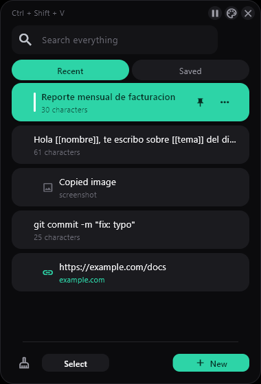
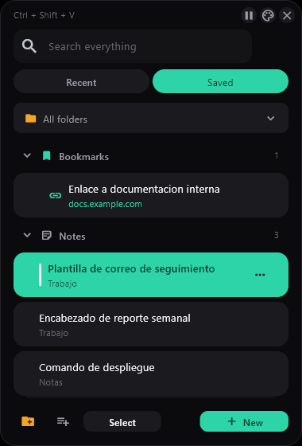
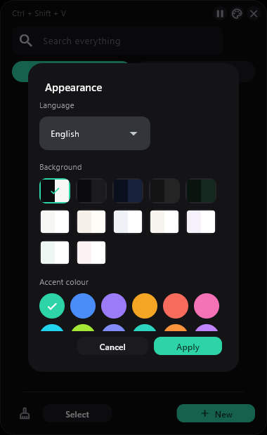
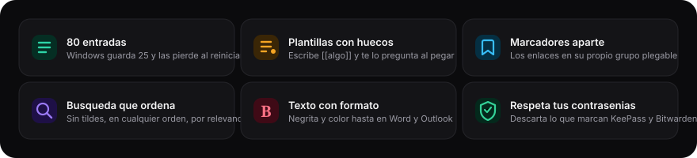

<div align="center">


<br>

[](#install)
[](https://www.python.org/downloads/)
[](LICENSE)
[](#languages)

**Windows keeps 25 clipboard entries and drops them on restart.**
<br>
pastepad keeps 80, plus whatever you file into your own folders, and never loses them.

English · **[Español](docs/README.es.md)**

</div>

---

<div align="center">

### Press <kbd>Ctrl</kbd> + <kbd>Shift</kbd> + <kbd>V</kbd> anywhere

Type two letters · <kbd>Enter</kbd> · the text lands where your cursor was

</div>

<br>

<div align="center">
  
  
  
</div>

<div align="center">
  <sub><b>Recent</b> — everything you copy &nbsp;·&nbsp; <b>Saved</b> — bookmarks and notes, apart &nbsp;·&nbsp; <b>Appearance</b> — 12 backgrounds, 18 accents</sub>
</div>

<br>

## What it does

<div align="center">
  
</div>

<br>

**Fill-in templates.** Write `[[anything]]` in a saved text and pastepad
asks for it before pasting:

```
Hi [[name]], following up on [[topic]] from [[date]].
```

**Bookmarks apart from notes.** Under Saved, links live in their own
collapsible group. That's not decoration: a bookmark opens in the
browser and a note gets pasted. Two different gestures — mixed
together, you have to read the whole list to find either.

**Respects password managers.** Windows defines
[clipboard formats](https://learn.microsoft.com/en-us/windows/win32/dataxchg/clipboard-formats)
an app uses to say "don't record this". KeePass, Bitwarden, Windows
Credential Manager and Chrome's incognito all use them. pastepad honours
all four and drops that content.

## Install

Download the `instalador` folder and double-click **`instalar.bat`**.

No administrator needed. It installs into `%LOCALAPPDATA%\pastepad`,
starts with Windows and adds a Start menu entry.

> [!NOTE]
> It installs there and not into *Program Files* on purpose: pastepad
> keeps its data next to the executable, and *Program Files* blocks
> writes **without saying so**. It would start but never save anything.

<details>
<summary><b>Run from source</b></summary>

<br>

```powershell
pip install -r requirements.txt
python main.py
```

Python 3.10 or newer from [python.org](https://www.python.org/downloads/).
Tick **Add python.exe to PATH** on the first installer screen.

</details>

<details>
<summary><b>Build the executable</b></summary>

<br>

```powershell
.\build.bat
```

Runs the tests, packages with `flet pack` and prints the SHA256. It
builds two things: the installable folder, and a single-file portable
`.exe`.

It uses `flet pack` rather than `flet build` because the latter
downloads the whole Flutter SDK — over a gigabyte.

</details>

<details>
<summary><b>"python311.dll was not found"</b></summary>

<br>

You copied `pastepad.exe` **on its own**, without the `_internal`
folder that sits beside it. The full Python interpreter lives in there:
pastepad does not need Python installed, but it does need that folder.

Either copy the whole folder, or use the **portable** build — one file
with everything inside, impossible to break that way.

Verified: the executable starts on a machine with no Python and no
Python on `PATH`.

</details>

<details>
<summary><b>Windows Defender flags it — why?</b></summary>

<br>

The first run will show *"Windows protected your PC"*. **More info →
Run anyway.**

To be clear: **an MIT licence and being open source do not prevent this
warning.** SmartScreen looks at neither. It looks at whether the binary
is signed, and how many people have downloaded it without incident.

| Option | Effect | Cost |
|---|---|---|
| Accept the warning | One click, once | 0 |
| Publish the SHA256 | Verifiable, warning stays | 0 |
| Free OSS certificate ([SignPath](https://signpath.org/), [OSSign](https://ossign.org/)) | Real certificate, reputation carries across releases | 0 for open source |
| [Azure Trusted Signing](https://learn.microsoft.com/en-us/windows/apps/package-and-deploy/code-signing-options) | Same, Microsoft-run | ~$10/month |
| Microsoft Store | Removes it entirely | Developer account |

A **self-signed** certificate does not help: Windows doesn't trust a
certificate that isn't from a recognised authority. And EV certificates
no longer grant instant reputation — that stopped years ago.

</details>

## Usage

| Key | Action |
|:--|:--|
| <kbd>Ctrl</kbd> <kbd>Shift</kbd> <kbd>V</kbd> | Open the panel at the cursor |
| Type | Filter as you go |
| <kbd>↑</kbd> <kbd>↓</kbd> | Move through results |
| <kbd>Enter</kbd> | Paste |
| <kbd>Esc</kbd> | Close |

Click into the field you want to fill **before** opening the panel.
pastepad records which window had focus and hands it back before
pasting.

**To close it for good** (the X only hides it):

```powershell
taskkill /IM pastepad.exe /F
```

## Languages

English · Español · Português · Français

Pick one under **Appearance → Language**; it persists between sessions.

Adding one means adding a dictionary to
[`pastepad/idiomas.py`](pastepad/idiomas.py). The key is the Spanish
source string, not an invented identifier: the code still reads on its
own without looking up what `btn.paste.plain` means, and anything left
untranslated falls back to Spanish instead of leaving a hole.

## Where your data lives

In `%LOCALAPPDATA%\pastepad`, as plain files you can copy:

```
snippets.json     saved texts and folders
historial.json    automatic history
config.json       language, theme, colour, shortcut, size
imagenes\         copied screenshots
```

> [!WARNING]
> **The history is stored unencrypted.** Password-manager content is
> dropped automatically, but anything else sensitive you copy does get
> written down. The broom empties it and the pause button stops capture.
> See [SECURITY.md](SECURITY.md).

## Decisions that might surprise you

<details>
<summary><b>The global shortcut doesn't use the <code>keyboard</code> library</b></summary>

<br>

It uses `RegisterHotKey` from the Windows API. The library installs a
`WH_KEYBOARD_LL` hook, and Windows **silently unhooks it** if the
callback takes longer than 300 ms (`LowLevelHooksTimeout`): the shortcut
would answer a few times and then die, leaving no error and no trace.

With `RegisterHotKey` there is no hook, and Windows tells you when
another program already owns the combination — something the library
never reported.

</details>

<details>
<summary><b>Saving is deferred</b></summary>

<br>

Automatic capture accumulates in memory and hits disk every 3 seconds.
Each copy used to rewrite the whole JSON: **7.8 ms and over a megabyte
per <kbd>Ctrl</kbd>+<kbd>C</kbd>**, up to 16 MB worst case.

It is 0.020 ms now. What you do on purpose — pin, delete, clear — still
writes immediately: deferring that would mean losing it if the program
dies.

</details>

<details>
<summary><b>The clipboard is only read when it changes</b></summary>

<br>

Windows has a counter (`GetClipboardSequenceNumber`) that ticks with
every copy. Reading it costs one call; opening the clipboard costs far
more.

</details>

<details>
<summary><b>A link opens, it doesn't paste</b></summary>

<br>

If the entry is nothing but a web address, clicking opens the browser.
A paragraph that merely mentions a URL doesn't count — see
`modelo.es_enlace()`, it has tests.

</details>

## Layout

```
main.py               entry point — calls ft.run()
pastepad/
  config.py           constants, limits and paths      [no flet]
  idiomas.py          the UI strings in 4 languages    [no flet]
  registro.py         errores.log — the only writer
  modelo.py           the data and its rules           [no flet]
  busqueda.py         ranked search with a cache       [no flet]
  windows.py          clipboard, focus, global hotkey
  estilo.py           colours, sizes and pieces
  filas.py            the list rows
  ventanas.py         the dialogs
  app.py              coordinates the above
prueba.py             19 tests — run without opening a window
instalador/           instalar.bat, desinstalar.bat
docs/
  ESPECIFICACION-UI.md    the interface in detail
  FUNCIONES.md            every function, three lines each
  maquetas/               the 20 reference SVG mockups
```

The five marked modules import no graphics library. That's why the
tests run without opening a window, and why migrating from tkinter to
Flet reused 40% of the code untouched.

## Why another one

[Ditto](https://github.com/sabrogden/Ditto) and
[CopyQ](https://github.com/hluk/CopyQ) are excellent and have years of
work behind them. This exists because my daily work needed two things
neither does out of the box: fill-in templates for notes I retype
constantly, and rich-text paste that survives into Outlook.

## Built with

Python and [Flet](https://flet.dev), which renders through Flutter on
the GPU — that's where the rounded corners, shadows and transitions come
from. Plus pywin32 for the clipboard, the windows and the global
shortcut.

Architecture notes in [CLAUDE.md](CLAUDE.md).

<div align="center">
<br>
<sub>

**[MIT](LICENSE)** · Built by [Jose Miguel Ortiz](https://github.com/Josemgu)

</sub>
</div>
