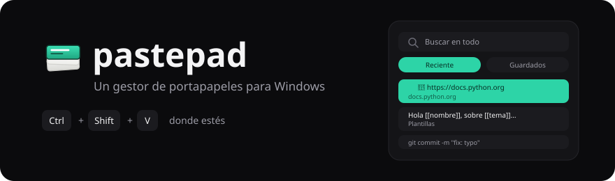
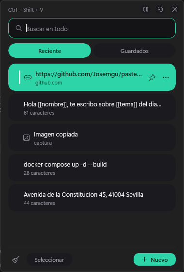
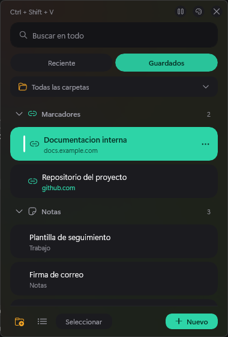
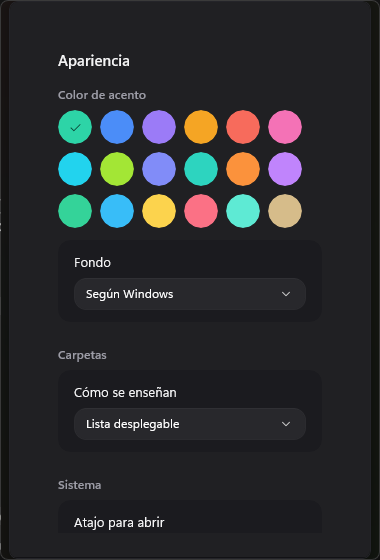

<div align="center">



<hr>

[](https://github.com/Josemgu/pastepad/releases/latest)
[](https://github.com/Josemgu/pastepad/actions/workflows/release.yml)

[](../LICENSE)

[English](../README.md) · [Español](README.es.md)

**Un gestor de portapapeles para Windows.**

[](https://github.com/Josemgu/pastepad/releases/latest)

</div>

Windows guarda 25 cosas en el portapapeles y las pierde al reiniciar.
pastepad guarda 80, más lo que archives en tus propias carpetas, que no
caducan.

Pulsa <kbd>Ctrl</kbd>+<kbd>Shift</kbd>+<kbd>V</kbd> donde estés. Escribe
dos letras, pulsa <kbd>Enter</kbd> y el texto cae en el campo donde
tenías el cursor.

<div align="center">
  
  
  
</div>

## Qué hace

Todo lo que copias aparece en Reciente, lo mismo un texto que una
captura. Lo que uses a menudo lo puedes fijar y se queda arriba.

Los textos guardados van en carpetas que nombras tú, y uno que lleve
`[[campos]]` dentro se convierte en plantilla: pastepad te los pregunta
antes de pegar.

Cada texto guardado es una de cinco cosas —marcador, plantilla, correo,
prompt de IA o nota— y Guardados tiene un grupo plegable para cada una.
pastepad te propone la que encaja con lo que escribiste y tú la cambias
si no acertó.

El correo y el prompt de IA son los dos que no adivina nunca, y por eso
mismo se pueden elegir: los dos son texto corriente y no llevan nada
dentro que diga lo que son. Cinco cuerpos de correo que empiezan todos
por «Hola equipo,» eran cinco notas más, y una biblioteca de prompts se
perdía entera entre ellas.

Si lo que copias es una dirección web y nada más, la fila enseña el
dominio y su menú trae «Abrir en el navegador». El clic pega, como en
todo lo demás de la lista.

La búsqueda cruza las dos pestañas. Las palabras pueden ir en cualquier
orden y las tildes dan igual.

Los gestores de contraseñas marcan su contenido como privado, y pastepad
no lo guarda nunca. Lo hacen KeePass, Bitwarden, el Administrador de
credenciales y las ventanas de incógnito de Chrome.

## Plantillas

Lo que envuelvas en `[[dobles corchetes]]` se convierte en un hueco que
rellenas al pegar. La fila lleva la marca `{}` para saber de un vistazo
cuál va a preguntar, y las plantillas van en su propio grupo dentro de
Guardados.

**Cómo se crea**

1. Abre el panel, ve a **Guardados** y pulsa **Nuevo**.
2. Escribe el texto y pon `[[corchetes]]` alrededor de lo que cambia
   cada vez.
3. Elige carpeta en **Guardar en** y pulsa **Agregar**.

**Cómo se usa**

Haz clic en el campo que quieres rellenar, abre el panel y pulsa la
plantilla. Sale **Completar antes de pegar**, con una casilla por hueco.
Los rellenas y pulsas **Pegar**.

Para datos que reescribes a todas horas:

```
Nombre: [[nombre]]
Apellido: [[apellido]]
Fecha de nacimiento: [[fecha de nacimiento]]
```

Para un correo:

```
Hola [[nombre]], te escribo sobre [[tema]] del día [[fecha]].
```

**Correos: una carpeta de asuntos y otra de cuerpos**

En Gmail y en Outlook el asunto y el cuerpo son dos campos distintos, y
pastepad pega en uno cada vez: aquel donde tenías el cursor. En vez de
pelearse con eso, dale una carpeta a cada uno:

1. Crea una carpeta **Asuntos** y otra **Cuerpos**.
2. Haz clic en el asunto, abre el panel y elige de **Asuntos**.
3. Haz clic en el cuerpo, abre el panel otra vez y elige de **Cuerpos**.

Dos pegados, y cada vez eliges el cuerpo que quieras en lugar de quedar
atado a uno. Las carpetas salen como fichas arriba, así que cada lista
está a un clic.

## Cómo se usa

| Tecla | Qué hace |
|:--|:--|
| <kbd>Ctrl</kbd> <kbd>Shift</kbd> <kbd>V</kbd> | Abre el panel junto al cursor |
| Escribir | Filtra según escribes |
| <kbd>↑</kbd> <kbd>↓</kbd> | Recorre los resultados |
| <kbd>Enter</kbd> | Pega |
| <kbd>Esc</kbd> | Cierra |

Haz clic en el campo que quieres rellenar antes de abrir el panel.
pastepad recuerda qué ventana tenía el foco y se lo devuelve antes de
pegar.

La X solo esconde el panel. Para cerrarlo del todo, Salir desde el icono
de la bandeja.

## Instalación

Descarga el instalador de la
[última versión](https://github.com/Josemgu/pastepad/releases/latest) y
ejecútalo. Ocupa 47 MB.

```
programa      %LOCALAPPDATA%\Programs\pastepad
datos         %LOCALAPPDATA%\pastepad
desinstalar   Configuración → Aplicaciones → Aplicaciones instaladas
```

Se instala solo para tu usuario, así que no pide permiso de
administrador — ni al instalar ni al actualizar. Al desinstalar se va el
programa y tus datos se quedan donde están, que es por lo que viven en
carpetas separadas.

pastepad te avisa cuando hay versión nueva, y al actualizarse no pierde
lo que acabas de copiar.

## El aviso de Windows

La primera vez sale *«Windows protegió su PC»*. Hay que pulsar **Más
información** y luego **Ejecutar de todas formas**.

SmartScreen no mira la licencia ni el código publicado. Mira si el
programa va firmado y cuánta gente lo ha descargado sin incidentes, y
uno nuevo y sin firmar no tiene ni lo uno ni lo otro. Se está
solicitando el certificado gratuito de [SignPath](https://signpath.org/),
que es lo que hace desaparecer el aviso de verdad.

Cada versión publica un `SHA256.txt` para comprobar que lo descargado es
lo que salió de la compilación.

## Cómo está hecho

C# sobre .NET 10 con WinUI 3. El portapapeles, el atajo global, el icono
de la bandeja y la devolución del foco son llamadas a Win32; lo demás es
XAML. La capa de datos tiene 78 pruebas que corren sin abrir ninguna
ventana.

Hasta la 3.0.1 el programa estaba escrito en Python con Flet. Se
abandonó porque el atajo global dejaba de responder a las pocas
pulsaciones. Aquel código sigue vivo en el tag `ultima-version-python`, y
en [PLAN.md](../PLAN.md) y [TRASPASO.md](../TRASPASO.md) está el
razonamiento.

## Tus datos

Están en `%LOCALAPPDATA%\pastepad`, como archivos normales que puedes
copiar o respaldar:

```
snippets.json     textos guardados y carpetas
historial.json    el historial automático
config.json       idioma, tema, color, atajo, tamaño
imagenes\         las capturas copiadas
```

El historial se guarda sin cifrar. Lo que venga de un gestor de
contraseñas se descarta solo, pero cualquier otra cosa delicada que
copies sí queda escrita. La escoba del pie vacía el historial y el botón
de pausa detiene la captura. Ver [SECURITY.md](../SECURITY.md).

Mejor no dejar la carpeta dentro de OneDrive: la sincronización puede
bloquear los archivos mientras pastepad escribe.

## Para dejarlo a tu gusto

Cuatro idiomas: español, inglés, portugués y francés.

Doce fondos y dieciocho colores de acento. «Según Windows» cambia el tema
en caliente cuando lo cambias tú. Los dieciocho acentos se comprobaron de
contraste contra el texto que se dibuja encima.

El panel se estira arrastrando sus bordes y recuerda dónde lo dejaste.

## Diseño

La interfaz se dibujó antes de construirse: 35 maquetas SVG en
[docs/mockups](mockups), y la paleta, las medidas y el comportamiento en
[ESPECIFICACION-UI.md](ESPECIFICACION-UI.md).

## Por qué otro más

[Ditto](https://github.com/sabrogden/Ditto) y
[CopyQ](https://github.com/hluk/CopyQ) son buenos programas con años de
trabajo detrás. Este existe porque mi trabajo diario pedía dos cosas que
ninguno de los dos hace de serie: plantillas con huecos para notas que
reescribo a todas horas, y pegado con formato que sobreviva al llegar a
Outlook.

---

<div align="center">
<sub>por <a href="https://github.com/Josemgu">Josemgu</a></sub>
</div>
